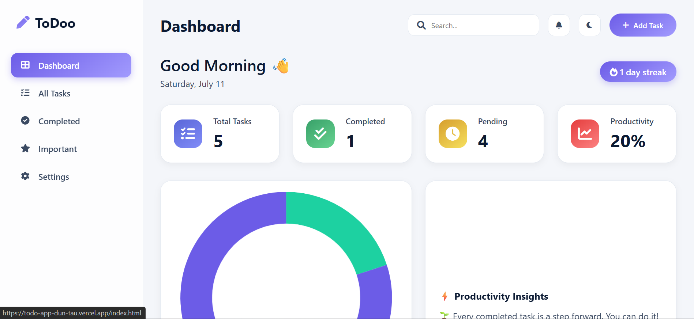
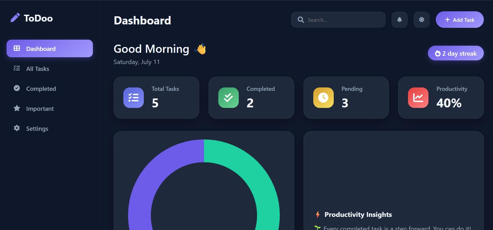

# ToDoo ⚡

**ToDoo** is a modern, portfolio-level productivity application built with pure HTML, CSS, and Vanilla JavaScript. It transforms a basic to-do list into a professional, SaaS-like dashboard inspired by premium tools like Notion, Todoist, and Linear.

---

## 🌐 Live Demo

**[Try ToDoo Live Here](https://todo-app-dun-tau.vercel.app/)**

---

## ✨ Features

### UI/UX & Design

- **Modern SaaS Interface**: Clean, minimal, and professional design.
- **Responsive Design**: Fully functional and beautiful on desktop, tablet, and mobile.
- **Light & Dark Modes**: Smooth theme toggling with system preference detection and `localStorage` persistence.
- **Glassmorphism Effects**: Elegant, blurred backgrounds on the sidebar and modals.
- **Smooth Animations**: Subtle transitions and animations for a premium user experience.
- **Custom Design System**: Built with CSS variables for a consistent and maintainable theme.

### Core Functionality

- **Full CRUD Operations**: Create, Read, Update, and Delete tasks.
- **Advanced Task Attributes**: Tasks include title, description, category, priority, due date, and creation date.
- **Persistent State**: All tasks are saved to `localStorage`, so your data is preserved across sessions.

### Productivity Dashboard (`index.html`)

- **Dynamic Greeting**: Welcomes the user based on the time of day.
- **Productivity Stats**: At-a-glance cards for Total, Completed, Pending tasks, and Productivity Rate.
- **Interactive Doughnut Chart**: Visualizes the ratio of completed vs. pending tasks, powered by Chart.js.
- **Productivity Insights**: A smart-text area that provides motivational feedback based on your progress.
- **Recent Tasks List**: Quickly view your most recently added tasks.
- **Task Streak Counter**: A fun metric to keep you motivated.

### All Tasks Page (`tasks.html`)

- **Advanced Filtering**: Filter tasks by status (All, Today, Upcoming, Important).
- **Category Filtering**: Drill down into specific categories (Work, Personal, etc.).
- **Dynamic Sorting**: Sort tasks by Newest, Oldest, Priority, or Due Date.
- **Live Search**: Instantly find tasks by title or description.
- **Elegant Empty State**: A beautiful placeholder when no tasks match the current view.

### Components

- **Modern Modals**: Smooth, animated modals for adding and editing tasks.
- **Toast Notifications**: Non-intrusive feedback for actions like creating, updating, or deleting tasks.
- **Redesigned Task Cards**: Clear, actionable cards with priority/category badges and an action menu.

---

## 🛠 Tech Stack

- **HTML5**: Semantic and accessible markup.
- **CSS3**: Modern layout (Flexbox, Grid), custom properties (variables), transitions, and animations.
- **Vanilla JavaScript (ES6+)**: All application logic, state management, and DOM manipulation without any frameworks.
- **Chart.js**: For beautiful and responsive data visualizations.
- **Font Awesome**: For a clean and modern icon set.

---

## 📸 Screenshots

### Dashboard - Light Mode

<p align="center">
  
</p>

### Dashboard - Dark Mode

<p align="center">
  
</p>

### Add Task

<p align="center">
  
</p>
---

## 🚀 Installation / Usage

This project requires no build steps or dependencies. You can run it directly in your browser.

1. Clone the repository:
   ```bash
   git clone https://github.com/your-github-username/todoo.git
   ```
2. Navigate to the project directory:
   ```bash
   cd todoo
   ```
3. Open `index.html` in your favorite web browser.

---

---

⚡ Future Features

- **Drag-and-Drop Reordering**: Allow users to reorder tasks visually.
- **User Authentication**: Add a backend (like Firebase or Supabase) for user accounts and cloud sync.
- **Advanced Settings**: Implement a settings page for more user customization.
- **Push Notifications**: Remind users of upcoming due dates.

---

📜 License

This project is licensed under the MIT License.

---

**Developed by [Your Name]**
